#  Documentation

Here you will find the documentation for the Sign app.
In this documentation the purpose and the functionality of the app is described.
It will also show the deployment of the app and give an installation guide for people that want to contribute in developing the app.

## Introduction
The Sign app is designed for people who want to learn sign language.
With the app, users can learn signs by watching videos.
The app provides a publicly available interface for [Signbank](https://signbank.cls.ru.nl/) videos, along with lists of words that users can learn and a test their knowledge of the sign language.

The backend uses Django 4.1 with Python 3.10, and the app is developed with Flutter, targeting Android and iOS phones.
Signs are taken from Signbank, which connects to the app through a RESTful API.

This document focuses on the design of the Sign app to provide a better understanding of how its different components work and communicate with each other.
It should also offer some insight into the application's functionality and constraints, highlighting some of the decisions made based on these attributes.

This document uses [C4 model](https://c4model.com/) and other diagrams to illustrate the full scope of the application.

## Requirements
This section presents the functional requirements in a high-level use-case diagram, followed by a description of the non-functional requirements based on the [ISO/IEC 25010](https://iso25000.com/index.php/en/iso-25000-standards/iso-25010) standard.
Only the most relevant non-functional requirements for this application are discussed in this document.

The high-level use cases will be described in more detail in the next section.

The stakeholders for this project are the developers at [Humanities lab](https://www.ru.nl/facultyofarts/research/humanities-lab/) and [Onno Crasborn](https://github.com/ocrasborn).
The primary and currently only relevant actor for the functional requirements is the user.

### High-level Use Case diagram 

In the diagram below show the main functional components of the application. 

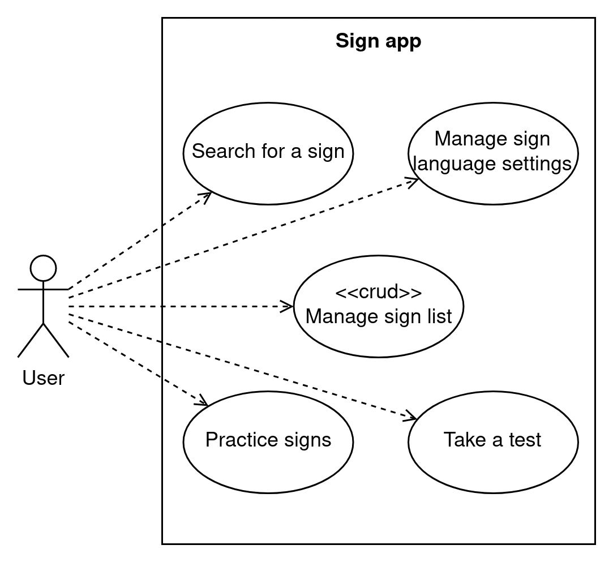

### Non functional requirements
The following is a list of non-functional requirements that the system needs to meet, arranged in order of priority.

#### Usability

| Code |         Type         | Description |
|:----:| -------------------- | ----------- |
| U-1a | Learnability              | The system should have a low learning curve, allowing users to quickly become proficient with its use |
| U-1b | Learnability              | The system should allow users to discover features and functions through intuitive navigation and exploration |
| U-2  | Operability               | The system should have a clear and straightforward user interface that is easy to understand and use |
| U-3a | User error protection     | The system should validate user inputs to ensure they are in the correct format and within the specified range |
| U-3b | User error protection     | The system should provide clear and concise error messages that explain why an error has occurred and how to correct it |
| U-4a | User interface aesthetics | The system should have a visually appealing design, using colors, typography, and imagery that are consistent with the brand and appealing to users |
| U-4b | User interface aesthetics | The system should have a clean and uncluttered user interface that is easy to navigate and understand |

#### Maintainability

| Code |         Type         | Description |
|:----:| -------------------- | ----------- |
| M-1  | Modularity    | Components should be interchangeable, allowing different components to be substituted for each other, if needed |
| M-2  | Reusability   | The system should be designed to be easily reusable, with clear interfaces and well-defined functionality |
| M-3a | Analysability | The system should have clear and well-documented architecture, with a clear understanding of the relationships between components |
| M-3b | Analysability | The system should have clear and well-documented testing and quality assurance processes, to support analysis of system performance and reliability |
| M-4a | Modifiability | The system should be modular, with components that can be easily added, removed, or modified |
| M-4b | Modifiability | The system should have clear and well-documented interfaces, to support integration and extension |
| M-5a | Testability   | The system should be designed with testability in mind, with clear separation between components and well-defined functionality |
| M-5b | Testability   | The system should have clear and well-documented testing processes and tools, to support efficient and effective testing |

#### Security
All the data used from Signbank is publicly available, and the aim is to minimize the storage of user data. To create a personal list, the user needs to provide identifying information, such as login credentials, which makes this information particularly sensitive and critical to protect. Although security is a concern for all data, it is particularly critical for sensitive information.

To ensure the security of the server against attacks, best practices from Django will be followed.

| Code |         Type         | Description |
|:----:| -------------------- | ----------- |
| S-1a | Confidentiality | The system should use strong encryption for sensitive data transmission and storage |
| S-1b | Confidentiality | The system should implement access controls to restrict access to sensitive information based on roles and permissions |
<!-- | S-3  | Non-repudiation | The system should use digital signatures and secure authentication mechanisms to ensure the identity of parties involved in transactions | -->
<!-- | S-4  | Accountability  | The system should have a clear and well-documented process for logging and auditing actions, to support evidence of participation | -->
<!-- | S-5  | Authenticity    || -->

#### Performance efficiency

| Code |         Type         | Description |
|:----:| -------------------- | ----------- |
| PE-1 | Time behaviour       | The system should load content in less than 3 seconds and should target under 1.3 seconds <sup id="a1">[1](#f1)</sup><sup id="a2">[2](#f2)</sup> |
| PE-2 | Resource utilization | Network request should be less than 500 KB in size <sup id="a3">[2](#f2)</sup> |
| PE-3 | Capacity             | The system should be designed with scalability in mind, allowing it to handle increases in capacity requirements, such as storage and network data, as needed |

#### Compatibility 

| Code |         Type         | Description |
|:----:| -------------------- | ----------- |
| C-1a | Co-existence         | The system should be compatible with other systems and technologies in the shared environment |
| C-1b | Co-existence         | The system should follow established standards and protocols for communication and data exchange with other systems |
| C-2  | Interoperability     | The system should provide mechanisms for exchanging data, such as APIs, to allow other systems to access and use its data |

#### Portability

| Code |         Type         | Description |
|:----:| -------------------- | ----------- |
| P-1a | Installability | The system should be packaged in a way that supports easy and efficient installation and deployment |
| P-1b | Installability | The system should have clear and well-documented installation instructions, to support users and administrators in the installation process |
| P-2  | Replaceability | The system should be designed with modular architecture, to allow for the easy replacement of individual components and features |
<!-- | P-1  | Adaptability   | The system should be designed with modular architecture, to support the addition, modification, and removal of components and features | -->

#### Reliability 
The reliability of the system is not a priority because Signbank does not prioritize reliability and may experience downtime, which may result in the Sign app being unable to access information from Signbank.
While this could temporarily affect the user's ability to use the app, it is deemed an acceptable trade-off given the nature and priorities of the project.
Therefore, the system is designed with low availability and low fault tolerance.

<!-- For some reason github wiki does not support footnotes so we fake it -->
<b id="f1">1:</b> Load times assumes the user has a 3G or better internet connection. [↩](#a1)

<b id="f2">2:</b> Numbers are based on [Google's](https://www.thinkwithgoogle.com/intl/en-154/marketing-strategies/app-and-mobile/how-stack-up-new-industry-benchmarks-for-mobile-page-speed/) best practices. [↩](#a2)[↩](#a3)

## Use-case Description

Here the [high-level use-cases](#high-level-use-cases) are described here in a fully dressed use-case form. This is done to get a better understanding of the functional requirements of the application.

The fully dressed use cases presume that the user has already installed the system and accessed the home page.

### Search for a sign
Below, you find the use-case *"Search for a sign,"* which consists of two parts: searching for a sign with a word and searching for a sign through the use of hand shapes and location of the hands.

#### Search for a sign with a word

The user wants to translate a word from their language into their chosen sign language.

<table>
<tbody>
  <tr>
    <td><b>Primary actor</b></td>
    <td colspan="2">User</td>
  </tr>
  <tr>
    <td><b>Brief Description</b></td>
    <td colspan="2">The user wants to know how to do a specific word in a sign language. So the user searches for that word and gets a list of videos back depicting how to perform that sign.</td>
  </tr>
  <tr>
    <td><b>Pre conditions</b></td>
    <td colspan="2">The user has access to the system and the system is functional.</td>
  </tr>
  <tr>
    <td><b>Post conditions</b></td>
    <td colspan="2">The user can view a video of the selected sign.</td>
  </tr>
  <tr>
    <td><b>Main Succes Scenario</b></td>
    <td><b>Actor Action</b></td>
    <td><b>System Responsibility</b></td>
  </tr>
  <tr>
    <td></td>
    <td>1. The user selects the search button. </td>
    <td>2. The system shows an input field. </td>
  </tr>
  <tr>
    <td></td>
    <td>3. The user enters their search query in the input field.</td>
    <td>4. The system shows a list with all the signs that match the search query.</td>
  </tr>
  <tr>
    <td></td>
    <td>5. The user selects one of the signs from the list.</td>
    <td>6. The system shows the video of the selected sign.</td>
  </tr>
  <tr>
    <td><b>Alternative Scenario</b></td>
    <td></td>
    <td>4a. The system can't find any signs matching the search query and informs the user.</td>
  </tr>
  <tr>
    <td></td>
    <td>4b. The user stops searching or tries again and then the use case continues at step 1.</td>
    <td></td>
  </tr>
</tbody>
</table>

#### Search for a sign by its properties 

The user wants to know the meaning of a sign.

<table>
<tbody>
  <tr>
    <td><b>Primary actor</b></td>
    <td colspan="2">User</td>
  </tr>
  <tr>
    <td><b>Brief Description</b></td>
    <td colspan="2">The user wants to know the meaning of a sign in their language. The user can search for the sign by giving information of the sign like the location, number of hands, movement direction and hand shape. If all these criteria match a specific sign the user will be redirected to a video page of the selected sign.</td>
  </tr>
  <tr>
    <td><b>Pre conditions</b></td>
    <td colspan="2">The user has access to the system and the system is functional.</td>
  </tr>
  <tr>
    <td><b>Post conditions</b></td>
    <td colspan="2">The user can view a video of the selected sign.</td>
  </tr>
  <tr>
    <td><b>Main Succes Scenario</b></td>
    <td><b>Actor Action</b></td>
    <td><b>System Responsibility</b></td>
  </tr>
  <tr>
    <td></td>
    <td>1. The user navigates to the correct search page.</td>
    <td>2. The system shows multiple options for the location where the sign could take place, such as the head or the stomach.</td>
  </tr>
  <tr>
    <td></td>
    <td>3. The user selects a location.</td>
    <td>4. The system asks how many hands where used for the sign.</td>
  </tr>
  <tr>
    <td></td>
    <td>5. The user gives the amount of hands used.</td>
    <td>6. The system shows different movement directions for the sign.</td>
  </tr>
  <tr>
    <td></td>
    <td>7. The user selects a movement direction that corresponds to the sign.</td>
    <td>8. The system shows multiple hand shapes that could be used in the sign.</td>
  </tr>
  <tr>
    <td></td>
    <td>9. The user selects a hand shape.</td>
    <td>10. The system shows information of the sign that matches the given input.</td>
  </tr>
  <tr>
    <td><b>Alternative Scenario</b></td>
    <td></td>
    <td>4a/6a/8a The system has found a limited number of signs matching the given input and shows a list of these signs instead of asking for more options.</td>
  </tr>
  <tr>
    <td></td>
    <td>4b/6b/8b The user selects a sign from the list.</td>
    <td>4c/6c/8c The system shows information of that sign.</td>
  </tr>
  <tr>
    <td></td>
    <td></td>
    <td>10a. The can't find any signs matching the given input.</td>
  </tr>
  <tr>
    <td></td>
    <td></td>
    <td>10b. The system discards the last given input and shows all the now matching signs. If there are no matching sign the system repeats this step.</td>
  </tr>
  <tr>
    <td></td>
    <td>10c. The user selects a sign from the given list. If no signs match the users intent than the user can stop searching or tries again and the use case starts at step 1.</td>
    <td></td>
  </tr>
</tbody>
</table>

## System context

This page shows the most zoomed out view of the system.
It provides an overview of the different systems used, including the Signbank which the Sign app utilizes to obtain sign language data.
The user only interacts with the Sign app, which displays this data.

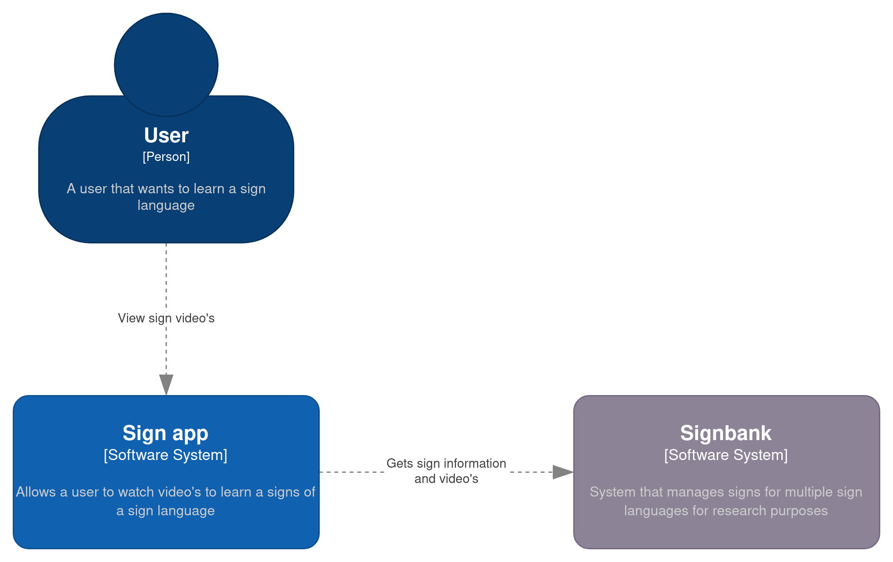

## System containers

As shown in the diagram below, the Sign app system comprises three containers: a mobile front-end that retrieves data from the Signbank, a back-end that serves data to the front-end, and an SQLite database that stores user data.

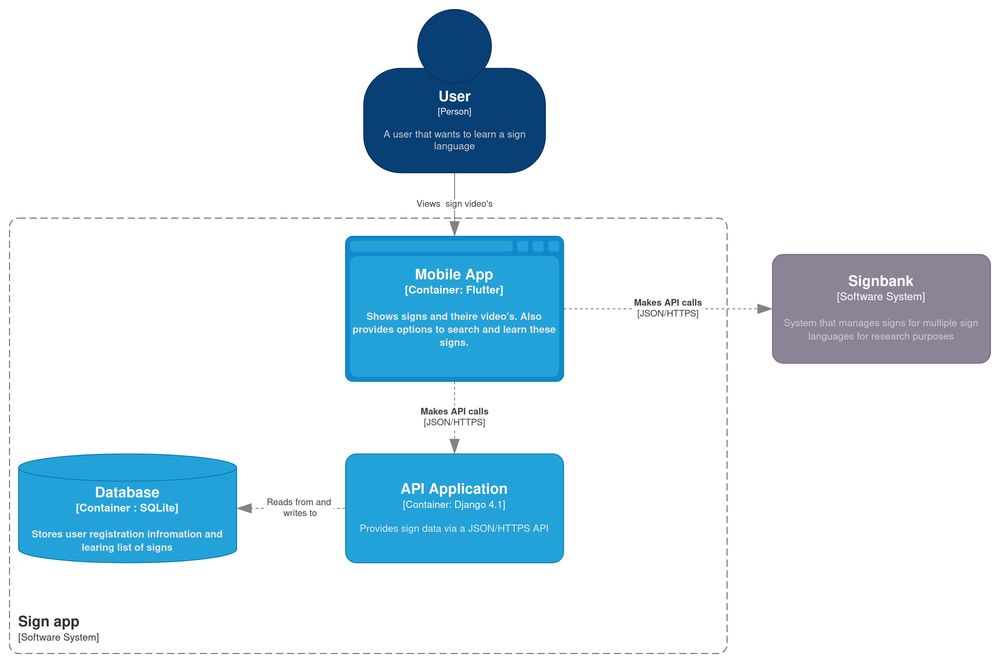

The back-end is hosted on the Ponyland cluster, see the [Ponyland wiki](https://ponyland.science.ru.nl/doku.php?id=wiki:ponyland:start) for more information about the cluster and the deployment of the application.

## User interface sketches
The rough sketches of the user interfaces and their components will be presented in this section.
These sketches provide an overview of the application's appearance, which components the front-end uses, and navigation routing through the app.

#### Home page
This is the initial landing page that the user encounters upon opening the app.
The user can start searching for a sign, learn some signs, manage their personal sign list, and access the app settings through a drawer from this page.

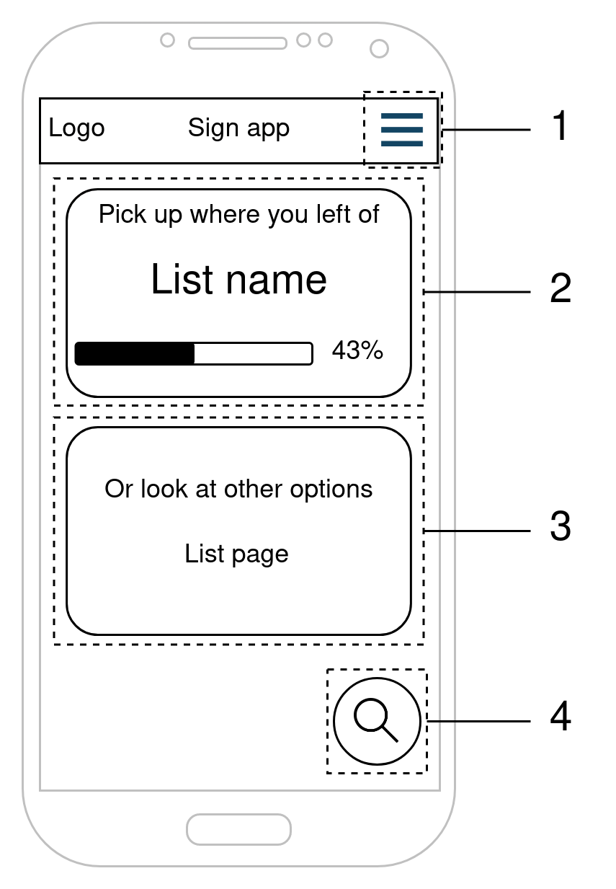

0. A hamburger button that opens a drawer allowing the user to navigate to different settings pages.
0. A component that initiates the learning feature.
0. A component that navigates to a page where the user can manage their personal list of signs.
0. A floating action button (FAB) that opens a dialog component, allowing the user to initiate the search function.

#### Search dialog
This dialog component is shown when the user presses the FAB in the home page.
From here the user can start the search by property use case or search by word via the input field.

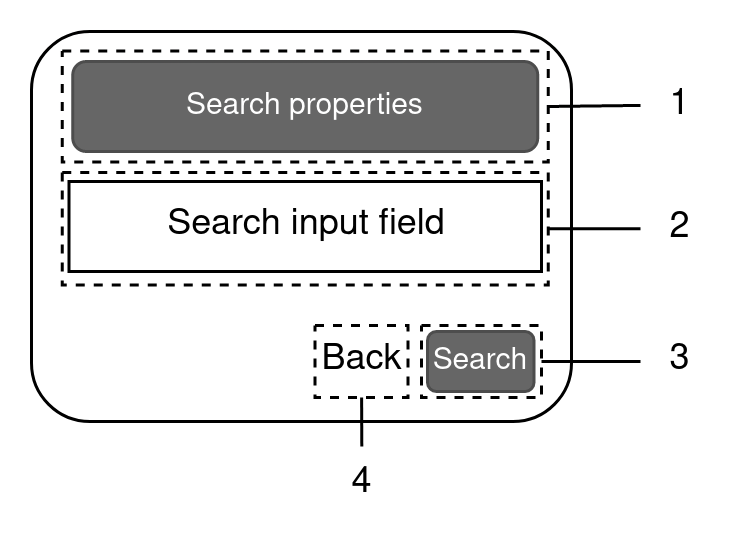

0. A button that navigates to the "Search by Property" page
0. An input field where the user can enter a word to be translated to a sign
0. A button that starts the search function using the input from #2
0. A back button that closes the dialog.

#### Sign/Property list
This page displays a list of items, which can include information about signs or sign properties.
The action taken when a user taps on an item can vary depending on the use case.
For more detailed information about the exact flow, please refer to the [fully dressed use cases](#use-case-description).

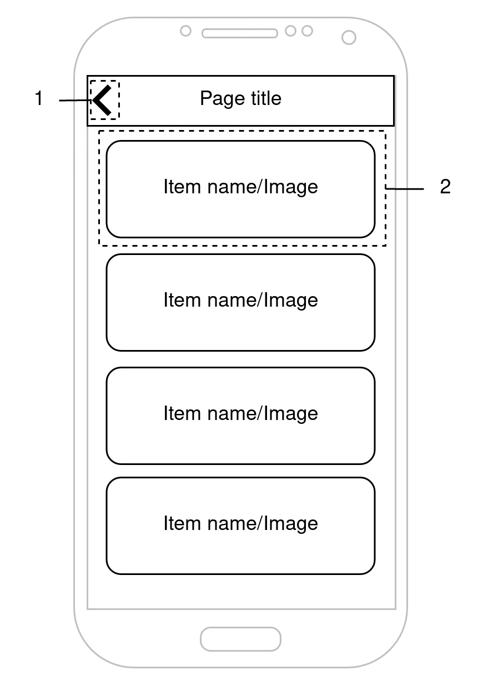

0. A back button that closes the page and returns the user to the home page.
0. An item that displays an image or name of the item. Selecting this component will navigate the user to the video page or refresh this page with new data.

#### Video page
On this page, users can view a video and accompanying information related to a specific sign.

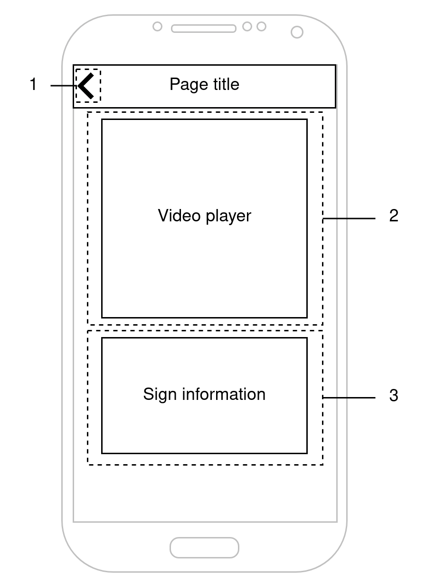

0. A back button that returns the user to the list page when clicked
0. The video player that displays the video of the sign
0. A section that shows additional information about the sign.

#### Video player
This component shows the video player with its UI elements.
It is designed as a separate component from the video page to allow its usage in other parts of the app.

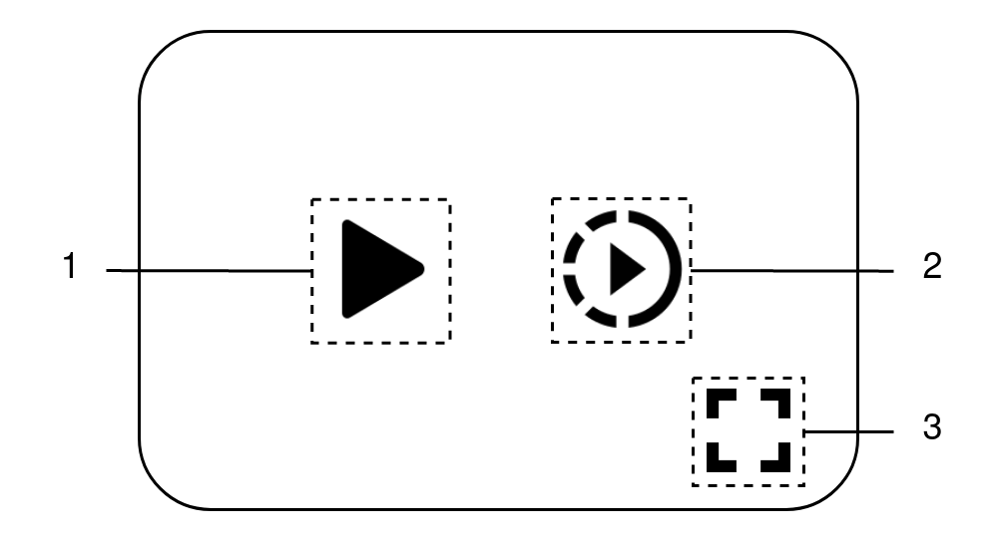

0. A Play/Pause button that starts or stops the video from playing.
0. A Slow Motion button that decreases the video speed.
0. A Fullscreen button that enlarges the video to fullscreen.

## System components
The following diagram depicts the structure of the different systems used in the Sign app.
Both the front-end and back-end follow the [Model-View-Controller (MVC)](https://en.wikipedia.org/wiki/Model%E2%80%93view%E2%80%93controller) pattern, although Django's implementation of the pattern differs slightly.
Please refer to their [FAQ](https://docs.djangoproject.com/en/4.1/faq/general/#django-appears-to-be-a-mvc-framework-but-you-call-the-controller-the-view-and-the-view-the-template-how-come-you-don-t-use-the-standard-names) for more information.
To make the structure consistent between Flutter and Django, the Flutter code also follows the same pattern.
This is expected to make it easier for newcomers to understand the structure.

The majority of these components are not concrete classes, but rather an abstract layer.
In the next section, the components will be described in more detail, including their functions and usages

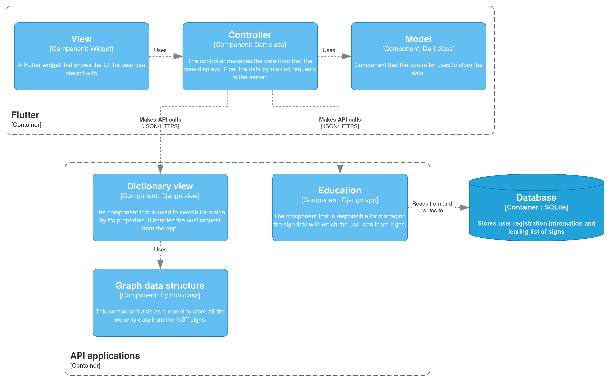

The [API endpoints documentation](api.md) provides a comprehensive list of all the possible requests for Signbank and the Sign app back-end.
It specifies the type of requests you can make, the data that the request expects, and the data that the request will return.

## Code

In this section, important parts of the code will be highlighted.
The code will be split into two parts: that from Flutter and Django.
Both parts will have their respective class diagrams.
The purpose of these diagrams is to show an overview of the code structure in concrete classes.
They will also explain important functions and attributes in more detail after the class diagram.

For clarity's sake, the class diagrams omit functions and attributes that do not add value to understanding the code base, such as getter, setter, and other methods.


### Flutter
In the class diagram for the Flutter code, some class associations or inheritance are left out to remove clutter.
For example, the view classes inherit from the Dart **"StatefulWidget"** class.
A **"StatefulWidget"** class is accompanied by a private **"State"** class, as is the norm in Flutter.
All of these things are left out to make the diagram more readable and are represented by a single view class.

It is recommended that if you are not familiar with the **"StatefulWidget"** and **"StatelessWidget"** classes from Flutter, you read [their documentation](https://docs.flutter.dev/development/ui/interactive#stateful-and-stateless-widgets) first to get a basic understanding of the framework

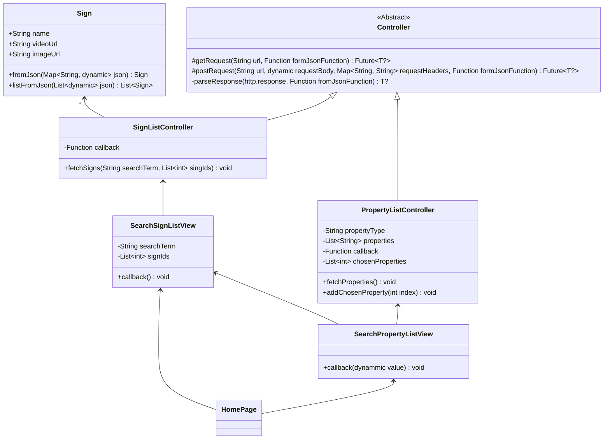

#### View
As mentioned previously, it is recommended that you examine the documentation for the StatelessWidget and StatefulWidget classes in Flutter before reviewing the code, to gain a basic understanding of the framework.
The view classes inherit from a widget class, which means that they override a build method to display the user interface.

##### Callback method
A view that uses a controller should implement a callback method.
The purpose of this method is to update the UI when the controller loads or changes data.
The simplest version of this function is to call **setState** in the callback function or pass the **setState** function to the controller.
The **setState** function reloads the UI and shows the updated data.
Read the Flutter documentation [here](https://api.flutter.dev/flutter/widgets/State/setState.html) for more information.

#### Controller
The controller class is responsible for managing the data in the view.
It retrieves the data from the server when it is not present.
Once the data is received from the server, the controller updates the view by calling the callback function that was set in the view, as mentioned above.

##### Abstract Controller
This class is the base for all controllers.
It provides methods that child controller classes can use to make HTTP requests to the server.
By creating a class that handles these requests, it is possible to remove duplicate code and have a consistent structure.
Another advantage is that it allows for implementing error handling in a singular place.

It is an abstract class, which means specific controller implementations should inherit from it.

All of the methods in this class are generic, which means they can be used with both model objects and primitive types, which makes it more flexible.
In the next section, we will provide a more detailed explanation of these methods.

###### Request methods
The GET and POST request methods use the dart HTTP library to make a request.
These methods require an endpoint URL and a function that can create an instance of type **T** from JSON.
Depending on the type of request, additional parameters may be required, such as a request body for a POST request.

These methods return a **future** of type **T?**.
A **Future** is the result of an asynchronous function.
You can learn more about **futures** and async programming in dart [here](https://dart.dev/codelabs/async-await). 
When the method completes, it returns an instance of type **T?**. 
The question mark indicates that the instance is allowed to be **null**. 
This means that controller implementations should check if the returned data is **null** and handle the situation appropriately.
When the return value is **null**, it indicates that something went wrong and the base controller should display an error message to the user.

You can specify the type of the method in the same way as you would specify the type of a class instance.
For example, the following code makes a GET request that returns a list of signs:

```
returnData = await super.getRequest<List<Sign>>(
          url: signBankBaseUrl + endpointUrl, 
          fromJsonFunction: Sign.listFromJson); 
```

###### Parse response
The request methods call the **parseResponse** function, which checks if the request was successful. 
If successful, it attempts to parse the JSON into an object by using **jsonDecode** and the given **fromJson** function.

The reason for providing the **fromJson** function as a parameter is to make the code more flexible.
This way, you can use a primitive type, an object, or for example list of objects, and you only need to adjust the function accordingly.

If the request or the parsing of an object fails, this function returns **null** and displays an error message to the user.

##### Controller implementation
Controller implementations such as the **SignListController** and **PropertyListController** inherit from the **Controller** class.
These classes are specific types of controllers that manage the model and update the view when the data is loaded.
They also specify which endpoint to call to receive the data.

To retrieve data from the server, these implementations use the request methods provided by the abstract controller class.

#### Model
The model is a simple class object that represents a domain or a data request structure.
In most cases, it is recommended to create a **"fromJson"** constructor or a **"toJson"** method that allows for serialization of the object using the **"jsonDecode"** and **"jsonEncode"** methods.
Of course, if there is no need to serialize the object, then it should not implement these methods.

The model is a simple class object that represents a domain or a data request structure.
In most cases it is recommended to create **"fromJson"** constructor or **"toJson"** method which allows for serialization of the object, with **"jsonDecode"** and **"jsonEndocde"** methods.
Of course if there is no need to serialize the object that it should not implement these methods.

### Django
In this section, the backend code will be discussed.
Django also uses a type of MVC for its code structure.
Because there are multiple [Django applications](https://docs.djangoproject.com/en/4.1/ref/applications/), that means there are also multiple view and model classes, and the code will be separated into these applications.
Basic Django features like the **urls.py** file will not be discussed here unless they deviate from the norm.

To make creating an API in Django easier the [Django REST framework](https://www.django-rest-framework.org/) is used.

#### Dictionary
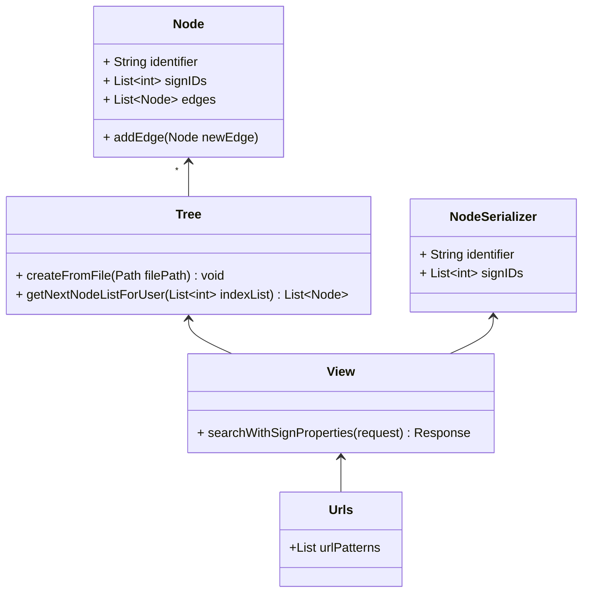

##### Tree
The **Tree** class is responsible for creating the data structure that holds all sign properties
For a more complete breakdown of the data structure and an explanation of what it looks like we recommend reading chapter six of the [research paper](https://github.com/Signbank/sign-app/blob/main/docs/research_paper.pdf).
Here the actual implementation will be discussed.

The tree is created from a file that holds all the frequency data, [this](https://github.com/Signbank/sign-app/tree/main/data_scripts) script generates that file from the Signbank database and the Dutch corpus frequency file.
To initialize it the **createFromFile** method has to be called with a path to the correct file.

To get access to the Signbank database and the Dutch corpus data for local testing, please contact the developers from Signbank.

##### View
The view is responsible for handling the request from the front-end.
The endpoint URL is set in the URL file, which points to this view and a specific function.
For all possible requests, please refer to the API documentation.

This view expects an HTTP request type and will return an HTTP response with a list of properties as the body.

##### NodeSerializer
The **serializers** class is a feature form the Django REST framework and is responsible for being able to serialize the **Node** class.
