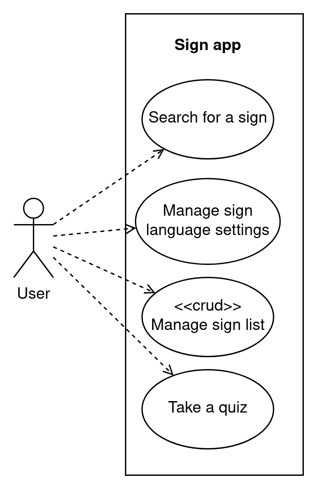

## Requirements
This section presents the functional requirements in a high-level use-case diagram, followed by a description of the non-functional requirements based on the [ISO/IEC 25010](https://iso25000.com/index.php/en/iso-25000-standards/iso-25010) standard.
Only the most relevant non-functional requirements for this application are discussed in this document.

The high-level use cases will be described in more detail in the next section.

The stakeholders for this project are the developers at [Humanities lab](https://www.ru.nl/facultyofarts/research/humanities-lab/) and [Onno Crasborn](https://github.com/ocrasborn).
The primary and currently only relevant actor for the functional requirements is the user.

### High-level Use Case diagram 

In the diagram below show the main functional components of the application. 

### Non functional requirements
The following is a list of non-functional requirements that the system needs to meet, arranged in order of priority.

#### Usability

| Code |         Type         | Description |
|:----:| -------------------- | ----------- |
| U-1a | Learnability              | The system should have a low learning curve, allowing users to quickly become proficient with its use |
| U-1b | Learnability              | The system should allow users to discover features and functions through intuitive navigation and exploration |
| U-2  | Operability               | The system should have a clear and straightforward user interface that is easy to understand and use |
| U-3a | User error protection     | The system should validate user inputs to ensure they are in the correct format and within the specified range |
| U-3b | User error protection     | The system should provide clear and concise error messages that explain why an error has occurred and how to correct it |
| U-4a | User interface aesthetics | The system should have a visually appealing design, using colors, typography, and imagery that are consistent with the brand and appealing to users |
| U-4b | User interface aesthetics | The system should have a clean and uncluttered user interface that is easy to navigate and understand |

#### Maintainability

| Code |         Type         | Description |
|:----:| -------------------- | ----------- |
| M-1  | Modularity    | Components should be interchangeable, allowing different components to be substituted for each other, if needed |
| M-2  | Reusability   | The system should be designed to be easily reusable, with clear interfaces and well-defined functionality |
| M-3a | Analysability | The system should have clear and well-documented architecture, with a clear understanding of the relationships between components |
| M-3b | Analysability | The system should have clear and well-documented testing and quality assurance processes, to support analysis of system performance and reliability |
| M-4a | Modifiability | The system should be modular, with components that can be easily added, removed, or modified |
| M-4b | Modifiability | The system should have clear and well-documented interfaces, to support integration and extension |
| M-5a | Testability   | The system should be designed with testability in mind, with clear separation between components and well-defined functionality |
| M-5b | Testability   | The system should have clear and well-documented testing processes and tools, to support efficient and effective testing |

#### Security
All the data used from Signbank is publicly available, and the aim is to minimize the storage of user data. To create a personal list, the user needs to provide identifying information, such as login credentials, which makes this information particularly sensitive and critical to protect. Although security is a concern for all data, it is particularly critical for sensitive information.

To ensure the security of the server against attacks, best practices from Django will be followed.

| Code |         Type         | Description |
|:----:| -------------------- | ----------- |
| S-1a | Confidentiality | The system should use strong encryption for sensitive data transmission and storage |
| S-1b | Confidentiality | The system should implement access controls to restrict access to sensitive information based on roles and permissions |
<!-- | S-3  | Non-repudiation | The system should use digital signatures and secure authentication mechanisms to ensure the identity of parties involved in transactions | -->
<!-- | S-4  | Accountability  | The system should have a clear and well-documented process for logging and auditing actions, to support evidence of participation | -->
<!-- | S-5  | Authenticity    || -->

#### Performance efficiency

| Code |         Type         | Description |
|:----:| -------------------- | ----------- |
| PE-1 | Time behaviour       | The system should load content in less than 3 seconds and should target under 1.3 seconds [1](#f1)[2](#f2) |
| PE-2 | Resource utilization | Network request should be less than 500 KB in size [2](#f2) |
| PE-3 | Capacity             | The system should be designed with scalability in mind, allowing it to handle increases in capacity requirements, such as storage and network data, as needed |

#### Compatibility 

| Code |         Type         | Description |
|:----:| -------------------- | ----------- |
| C-1a | Co-existence         | The system should be compatible with other systems and technologies in the shared environment |
| C-1b | Co-existence         | The system should follow established standards and protocols for communication and data exchange with other systems |
| C-2  | Interoperability     | The system should provide mechanisms for exchanging data, such as APIs, to allow other systems to access and use its data |

#### Portability

| Code |         Type         | Description |
|:----:| -------------------- | ----------- |
| P-1a | Installability | The system should be packaged in a way that supports easy and efficient installation and deployment |
| P-1b | Installability | The system should have clear and well-documented installation instructions, to support users and administrators in the installation process |
| P-2  | Replaceability | The system should be designed with modular architecture, to allow for the easy replacement of individual components and features |
<!-- | P-1  | Adaptability   | The system should be designed with modular architecture, to support the addition, modification, and removal of components and features | -->

#### Reliability 
The reliability of the system is not a priority because Signbank does not prioritize reliability and may experience downtime, which may result in the Sign app being unable to access information from Signbank.
While this could temporarily affect the user's ability to use the app, it is deemed an acceptable trade-off given the nature and priorities of the project.
Therefore, the system is designed with low availability and low fault tolerance.

<!-- For some reason github wiki does not support footnotes so we fake it -->
<b id="f1">1:</b> Load times assumes the user has a 3G or better internet connection. [↩](#a1)

<b id="f2">2:</b> Numbers are based on [Google's](https://www.thinkwithgoogle.com/intl/en-154/marketing-strategies/app-and-mobile/how-stack-up-new-industry-benchmarks-for-mobile-page-speed/) best practices. [↩](#a2)[↩](#a3)
