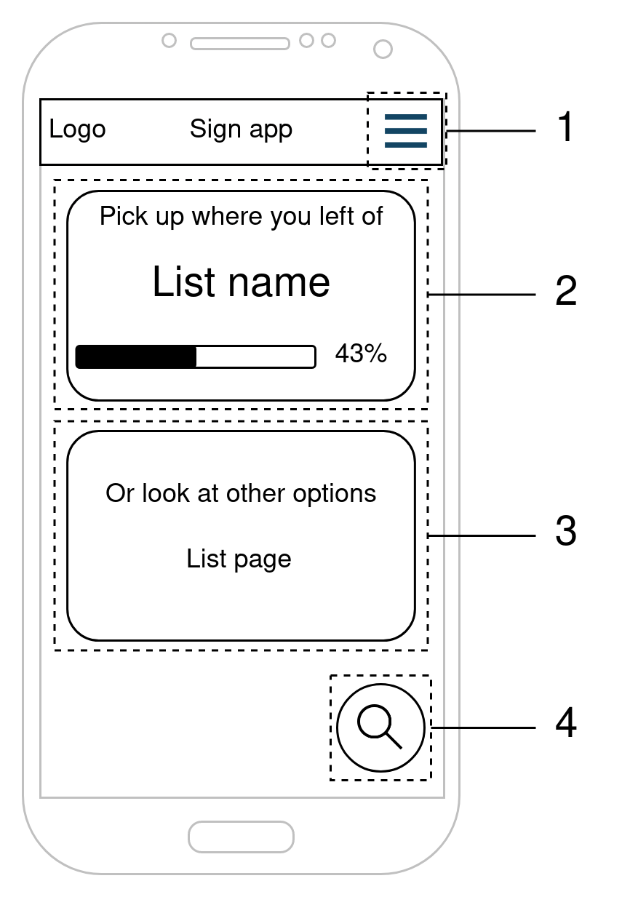
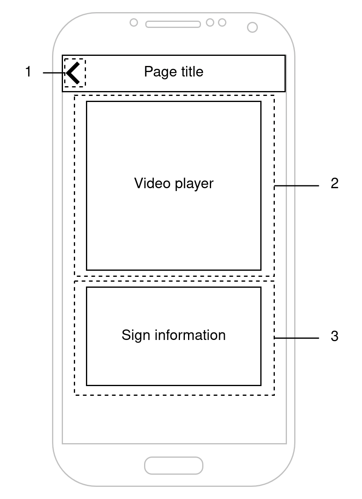

#  User interface sketches

The rough sketches of the user interfaces and their components will be presented in this section.
These sketches provide an overview of the application's appearance, which components the front-end uses, and navigation routing through the app.

#### Home page
This is the initial landing page that the user encounters upon opening the app.
The user can start searching for a sign, learn some signs, manage their personal sign list, and access the app settings through a drawer from this page.

0. A hamburger button that opens a drawer allowing the user to navigate to different settings pages.
0. A component that initiates the learning feature.
0. A component that navigates to a page where the user can manage their personal list of signs.
0. A floating action button (FAB) that opens a dialog component, allowing the user to initiate the search function.

#### Search dialog
This dialog component is shown when the user presses the FAB in the home page.
From here the user can start the search by property use case or search by word via the input field.

0. A button that navigates to the "Search by Property" page
0. An input field where the user can enter a word to be translated to a sign
0. A button that starts the search function using the input from #2
0. A back button that closes the dialog.

#### Sign/Property list
This page displays a list of items, which can include information about signs or sign properties.
The action taken when a user taps on an item can vary depending on the use case.
For more detailed information about the exact flow, please refer to the [fully dressed use cases](#use-case-description).

0. A back button that closes the page and returns the user to the home page.
0. An item that displays an image or name of the item. Selecting this component will navigate the user to the video page or refresh this page with new data.

#### Video page
On this page, users can view a video and accompanying information related to a specific sign.

0. A back button that returns the user to the list page when clicked
0. The video player that displays the video of the sign
0. A section that shows additional information about the sign.

#### Video player
This component shows the video player with its UI elements.
It is designed as a separate component from the video page to allow its usage in other parts of the app.

0. A Play/Pause button that starts or stops the video from playing.
0. A Slow Motion button that decreases the video speed.
0. A Fullscreen button that enlarges the video to fullscreen.

#### Quiz page
On this page, users can view a video of a sign and has to give the meaning of that sign.

0. A back button that returns the user to the home screen page when clicked
0. The video player that displays the video of the sign
0. A list of multiple choice answers that the user can select
0. A button that check the answer given by the user
